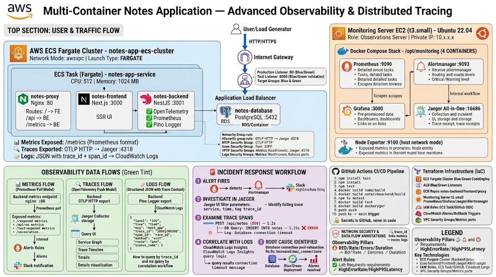

# Multi-Container Notes Application — Advanced Observability & Distributed Tracing

A production-grade full-stack Notes application with end-to-end observability, distributed tracing, and automated alerting. This project demonstrates OpenTelemetry instrumentation, Prometheus metrics collection, Jaeger trace correlation, and alert-driven incident response workflows deployed on AWS ECS Fargate with Blue/Green deployment strategy.

---

## Table of Contents

- [Project Description](#project-description)
- [Motivation](#motivation)
- [Architecture](#architecture)
- [Key Technologies](#key-technologies)
- [Prerequisites](#prerequisites)
- [Installation](#installation)
- [Usage](#usage)
- [Observability Stack](#observability-stack)
- [Alert → Trace → Log Correlation](#alert--trace--log-correlation)
- [Project Structure](#project-structure)
- [Learning Outcomes](#learning-outcomes)
- [Challenges & Solutions](#challenges--solutions)
- [Future Improvements](#future-improvements)
- [Contributing](#contributing)
- [License](#license)
- [Author](#author)

---

## Project Description

This project implements a containerized Notes application with comprehensive observability instrumentation. The application exposes RED metrics (Rate, Errors, Duration) via Prometheus, exports distributed traces to Jaeger using OpenTelemetry, and correlates logs with trace IDs for root cause analysis. Alert rules trigger on error rate >5% or P95 latency >300ms, enabling symptom → trace → log workflows for rapid incident resolution.

The infrastructure runs on AWS ECS Fargate with Blue/Green deployments via CodeDeploy, providing zero-downtime releases with automatic rollback on CloudWatch alarm triggers.

---

## Motivation

This project was built to master production-grade observability practices for distributed systems. The goals were to:

- Implement OpenTelemetry instrumentation for HTTP servers, clients, and database calls
- Expose custom Prometheus metrics (request counters, latency histograms) alongside Node.js runtime metrics
- Correlate distributed traces with structured logs using trace_id and span_id injection
- Build actionable Grafana dashboards linking latency spikes to Jaeger trace spans
- Configure alert rules that trigger on SLO violations and enable rapid root cause identification
- Deploy a scalable observability stack (Prometheus, Alertmanager, Grafana, Jaeger) on dedicated infrastructure
- Demonstrate incident response workflows: alert → trace → log → root cause

---

## Architecture

The application consists of four containers orchestrated on AWS ECS Fargate:

1. **Nginx (Reverse Proxy)**: Routes traffic to frontend/backend, exposes /metrics endpoint
2. **Next.js (Frontend)**: Server-side rendered UI
3. **NestJS (Backend API)**: REST API with TypeORM, instrumented with OpenTelemetry and Prometheus
4. **PostgreSQL (Database)**: Relational database with connection pooling

Traffic flows through an Application Load Balancer → Nginx → Frontend/Backend. The backend exports traces to Jaeger via OTLP HTTP and exposes /metrics for Prometheus scraping.

A dedicated monitoring server runs Prometheus, Alertmanager, Grafana, and Jaeger, scraping metrics from the ECS tasks over the VPC network and receiving traces via OTLP.

### Architecture Diagram



### ECS Fargate Architecture


### Blue/Green Deployment Architecture


---

## Key Technologies

### Application Stack

- **NestJS**: Backend API framework with dependency injection and TypeORM integration. Chosen for structured architecture and first-class TypeScript support.
- **Next.js**: Frontend framework with server-side rendering. Provides fast initial page loads and SEO optimization.
- **PostgreSQL**: Relational database. Runs in an isolated network; only the backend can connect.
- **Nginx**: Reverse proxy for routing, rate limiting, and single-entry-point architecture.
- **Docker & Docker Compose**: Containerization and local orchestration. Ensures consistency between development and production.

### Observability Stack

- **OpenTelemetry**: Vendor-neutral instrumentation for traces, metrics, and logs. Auto-instruments HTTP servers, clients, and database calls.
- **Jaeger**: Distributed tracing backend. Stores and visualizes trace spans with sub-millisecond resolution.
- **Prometheus**: Time-series metrics database. Scrapes /metrics endpoints every 15 seconds and evaluates alert rules.
- **Alertmanager**: Alert routing and notification service. Groups, deduplicates, and routes firing alerts to Slack.
- **Grafana**: Metrics visualization with pre-provisioned dashboards and auto-configured Prometheus datasource.
- **Pino**: Structured JSON logger for Node.js. Injects trace_id and span_id into every log line for correlation.

### Infrastructure & CI/CD

- **AWS ECS Fargate**: Serverless container orchestration. Eliminates EC2 instance management overhead.
- **AWS CodeDeploy**: Blue/Green deployment automation with traffic shifting (10% per minute) and automatic rollback.
- **Application Load Balancer**: Layer 7 load balancing with health checks and test listener (port 8080) for Blue/Green validation.
- **Terraform**: Infrastructure-as-code for AWS. Provisions ECS, ALB, ECR, IAM roles, security groups, and CloudWatch alarms.
- **GitHub Actions**: CI/CD automation. Runs tests, builds images, pushes to ECR, and triggers CodeDeploy.
- **Amazon ECR**: Container registry for application images. Integrated with IAM and avoids Docker Hub rate limits.

---

## Prerequisites

- Docker 24.0+
- Docker Compose v2+
- Terraform 1.0+
- Node.js 20.x (for local development)
- AWS CLI v2 (for Terraform and manual operations)
- Git
- An AWS account with permissions for ECS, ECR, IAM, ALB, CodeDeploy, and CloudWatch

---

## Installation

### 1. Clone the repository

```bash
git clone https://github.com/celetrialprince166/Multi_Container_App.git
cd Multi_Container_App
```

### 2. Local development (Docker Compose)

```bash
cp .env.example .env
# Edit .env with your DB credentials
docker compose up -d
```

The application will be available at `http://localhost`.

### 3. Deploy infrastructure with Terraform

```bash
cd terraform
cp terraform.tfvars.example terraform.tfvars
# Edit terraform.tfvars (region, environment, github_org, github_repo)
terraform init
terraform plan
terraform apply
```

Terraform provisions:
- ECS Fargate cluster with Blue/Green deployment configuration
- Application Load Balancer with production (80) and test (8080) listeners
- ECR repositories for backend, frontend, and proxy images
- CodeDeploy application and deployment group
- CloudWatch alarms for automatic rollback (5xx errors, unhealthy targets)
- Dedicated monitoring EC2 instance with Prometheus, Grafana, Jaeger, and Alertmanager
- Security groups restricting metrics ports to monitoring server only

### 4. Configure GitHub Secrets

After `terraform apply`, configure these repository secrets (Settings → Secrets and variables → Actions):

| Secret           | Source                                          |
|------------------|-------------------------------------------------|
| `DB_USERNAME`    | Your choice (e.g., `notesapp_admin`)            |
| `DB_PASSWORD`    | Strong password                                 |
| `DB_NAME`        | `notesdb`                                       |
| `AWS_REGION`     | `eu-west-1` (or your region)                    |
| `AWS_ROLE_ARN`   | `terraform output github_actions_role_arn`      |
| `ECS_CLUSTER`    | `terraform output ecs_cluster_name`             |
| `ECS_SERVICE`    | `terraform output ecs_service_name`             |

### 5. First deployment

Push to the `main` branch. GitHub Actions will:
1. Build and test backend/frontend
2. Build Docker images and push to ECR
3. Register new ECS task definition with updated image tags
4. Trigger CodeDeploy Blue/Green deployment
5. Shift traffic 10% per minute with test listener validation
6. Automatically roll back if CloudWatch alarms fire

Access the application at the ALB DNS name: `terraform output alb_dns_name`

---

## Usage

### Local development

```bash
# Start all services (app + observability stack)
docker compose up -d
docker compose -f monitoring/docker-compose.monitoring.yml up -d

# View logs
docker compose logs -f backend

# View traces
open http://localhost:16686  # Jaeger UI

# View metrics
open http://localhost:9090  # Prometheus
open http://localhost:3000  # Grafana (admin/NotesApp@Grafana2024!)

# Stop services
docker compose down
docker compose -f monitoring/docker-compose.monitoring.yml down
```

### Infrastructure

```bash
cd terraform

# Plan changes
terraform plan

# Apply changes
terraform apply

# Output application URL
terraform output alb_dns_name

# Output monitoring server IP
terraform output monitoring_server_ip
```

### Accessing the Observability Stack

1. **Get the Monitoring Server IP:**
   ```bash
   terraform output monitoring_server_ip
   ```

2. **Access the UIs:**

   | Service | URL | Credentials |
   |---|---|---|
   | Grafana | `http://<MONITORING_IP>:3000` | admin / (from terraform.tfvars) |
   | Prometheus | `http://<MONITORING_IP>:9090` | None |
   | Jaeger | `http://<MONITORING_IP>:16686` | None |
   | Alertmanager | `http://<MONITORING_IP>:9093` | None |

3. **Reload Prometheus config** (no container restart needed):
   ```bash
   curl -X POST http://<MONITORING_IP>:9090/-/reload
   ```

---

## Observability Stack

### Metrics Collection (Prometheus)

The backend exposes two custom metrics at `/metrics`:

1. **http_requests_total** (Counter)
   - Labels: `method`, `route`, `status_code`
   - Used for: Request rate and error rate calculations
   - Example query: `sum(rate(http_requests_total{status_code=~"5.."}[5m])) / sum(rate(http_requests_total[5m]))`

2. **http_request_duration_seconds** (Histogram)
   - Labels: `method`, `route`, `status_code`
   - Buckets: `[0.005, 0.01, 0.025, 0.05, 0.1, 0.25, 0.5, 1, 2.5, 5, 10]`
   - Used for: P50/P95/P99 latency dashboards
   - Example query: `histogram_quantile(0.95, sum(rate(http_request_duration_seconds_bucket[5m])) by (le))`

Additionally, Node.js runtime metrics are automatically collected:
- `notes_nodejs_heap_size_used_bytes`
- `notes_nodejs_eventloop_lag_seconds`
- `notes_process_cpu_seconds_total`
- `notes_nodejs_active_handles_total`

**Prometheus Targets Dashboard:**


### Distributed Tracing (Jaeger + OpenTelemetry)

The backend is instrumented with OpenTelemetry SDK, exporting traces via OTLP HTTP to Jaeger:

- **Service name**: `notes-backend`
- **Auto-instrumentation**: HTTP server, HTTP client, PostgreSQL queries
- **Trace export**: `http://jaeger:4318/v1/traces`
- **Sampling**: 100% (suitable for lab workloads; reduce in production)

Every HTTP request generates a trace with spans for:
- HTTP request handling (method, route, status code)
- Database queries (SQL statement, duration)
- External HTTP calls (if any)

Traces are linked to logs via `trace_id` and `span_id` injection.

### Structured Logging (Pino + OpenTelemetry)

All logs are emitted as structured JSON with automatic trace context injection:

```json
{
  "level": 30,
  "time": 1704067200000,
  "msg": "GET /api/notes 200 45ms",
  "trace_id": "a1b2c3d4e5f6g7h8i9j0k1l2m3n4o5p6",
  "span_id": "1234567890abcdef",
  "method": "GET",
  "route": "/api/notes",
  "status_code": 200,
  "duration_ms": 45
}
```

Logs are sent to CloudWatch Logs (ECS) or stdout (local development). The `trace_id` enables correlation: alert → Jaeger trace → CloudWatch Logs Insights query.

### Alert Rules

Six pre-configured alert rules in [`alert_rules.yml`](monitoring/alert_rules.yml):

| Alert | Severity | Condition | Duration | Lab Requirement |
|---|---|---|---|---|
| `BackendDown` | 🔴 critical | Backend `/metrics` unreachable | 30s | — |
| `HighErrorRate` | 🔴 critical | 5xx responses > 5% of total | 10 min | ✅ >5% for 10m |
| `HighP95Latency` | 🟡 warning | P95 response time > 300ms | 10 min | ✅ >300ms for 10m |
| `HighCPU` | 🟡 warning | CPU utilisation > 80% | 5 min | — |
| `LowMemory` | 🟡 warning | Available RAM < 200MB | 2 min | — |
| `DiskSpaceLow` | 🟡 warning | Disk usage > 85% | 5 min | — |

### Notification Pipeline (Alertmanager → Slack)

Alertmanager routes firing alerts to Slack:

- **Critical alerts** → `#alerts` channel, repeated every **1 hour**
- **Warning alerts** → `#alerts` channel, repeated every **4 hours**
- **Resolved** notifications are sent automatically when alerts clear
- **Inhibition**: Critical alerts suppress warnings for the same target
- **Grouping**: Related alerts are batched into a single message (30s window)

**Live Alert Example:**


### Grafana Dashboard

A pre-provisioned **Notes App Dashboard** is auto-loaded on first boot with panels for:

- Request rate and error rate by method, route, and status code
- Response time percentiles (P50, P95, P99) with threshold annotations
- CPU, memory, and disk usage for ECS tasks
- Node.js runtime metrics (heap, event loop lag, GC pauses)
- Active alerts panel with links to Prometheus

**Grafana Dashboard:**


---

## Alert → Trace → Log Correlation

This section demonstrates the lab requirement: **alert → trace → log correlation showing root cause identification**.

### Scenario: High Error Rate Alert

1. **Alert Fires** (Prometheus → Alertmanager → Slack)
   ```
   🔴 FIRING: HighErrorRate
   Error rate is 8.3% over the last 5 minutes.
   Next steps: inspect Jaeger traces for service notes-backend
   ```

2. **Investigate in Jaeger**
   - Open Jaeger UI: `http://<MONITORING_IP>:16686`
   - Filter by service: `notes-backend`
   - Filter by time range: last 10 minutes
   - Filter by tags: `http.status_code=500`
   - Identify failing operation: `POST /api/notes`

3. **Examine Trace Spans**
   - Click on a failing trace
   - Observe span hierarchy:
     ```
     POST /api/notes (500) — 1.2s
       ├─ DB Query: INSERT INTO notes — 1.15s ❌ ERROR
       └─ Log: Database connection timeout
     ```
   - Copy `trace_id`: `a1b2c3d4e5f6g7h8i9j0k1l2m3n4o5p6`

4. **Correlate with Logs (CloudWatch Logs Insights)**
   ```sql
   fields @timestamp, msg, trace_id, span_id, error
   | filter trace_id = "a1b2c3d4e5f6g7h8i9j0k1l2m3n4o5p6"
   | sort @timestamp desc
   ```

   **Result:**
   ```json
   {
     "timestamp": "2024-01-01T12:34:56.789Z",
     "level": "error",
     "msg": "Database query failed",
     "trace_id": "a1b2c3d4e5f6g7h8i9j0k1l2m3n4o5p6",
     "span_id": "1234567890abcdef",
     "error": "Connection timeout after 5000ms",
     "query": "INSERT INTO notes (title, content) VALUES ($1, $2)"
   }
   ```

5. **Root Cause Identified**
   - Database connection pool exhausted
   - Fix: Increase `max_connections` in PostgreSQL config
   - Deploy fix via Blue/Green deployment
   - Verify alert resolves

### Evidence Screenshots

| Step | Screenshot |
|---|---|
| Alert firing in Slack | [slackalertscreenshot.png](images/slackalertscreenshot.png) |
| Jaeger trace with error span | *(Capture during load test)* |
| CloudWatch Logs with trace_id | *(Capture during load test)* |
| Grafana dashboard showing spike | [grafanadash.png](images/grafanadash.png) |

---

## Project Structure

```
Multi_Container_App/
├── .github/
│   └── workflows/
│       └── ci-cd.yml              # Build, test, push to ECR, trigger CodeDeploy
├── backend/                       # NestJS API
│   ├── src/
│   │   ├── telemetry/
│   │   │   └── tracing.ts         # OpenTelemetry SDK initialization
│   │   ├── logger/
│   │   │   └── logger.module.ts   # Pino logger with trace_id injection
│   │   ├── metrics.module.ts      # Prometheus metrics registration
│   │   ├── http-metrics.interceptor.ts  # Request counter + histogram
│   │   └── main.ts                # Bootstrap with tracing import
│   ├── Dockerfile
│   └── package.json               # OpenTelemetry + Prometheus dependencies
├── frontend/                      # Next.js application
│   ├── app/
│   ├── Dockerfile
│   └── package.json
├── nginx/                         # Reverse proxy
│   ├── nginx.conf                 # Routes /metrics to backend
│   └── Dockerfile
├── monitoring/
│   ├── docker-compose.monitoring.yml  # Prometheus + Alertmanager + Grafana + Jaeger
│   ├── prometheus.yml             # Scrape configs + alerting block
│   ├── alert_rules.yml            # 6 alert rules (error rate, latency, CPU, memory, disk)
│   ├── alertmanager.yml           # Slack routing, grouping, inhibition rules
│   └── grafana/
│       ├── provisioning/
│       │   ├── datasources/
│       │   │   └── prometheus.yml # Auto-provision Prometheus datasource
│       │   └── dashboards/
│       │       └── dashboard.yml  # Dashboard loader config
│       └── dashboards/
│           └── notes-app-dashboard.json  # Pre-built dashboard
├── terraform/
│   ├── main.tf                    # Provider, data sources
│   ├── ecs.tf                     # ECS cluster, service, task definition
│   ├── alb.tf                     # Application Load Balancer + target groups
│   ├── codedeploy.tf              # Blue/Green deployment config
│   ├── cloudwatch.tf              # Alarms for automatic rollback
│   ├── ecr.tf                     # ECR repositories
│   ├── iam.tf                     # IAM roles, OIDC provider
│   ├── monitoring.tf              # Monitoring EC2 instance
│   ├── security_groups.tf         # Firewall rules
│   └── outputs.tf                 # Output values
├── ecs/
│   ├── task-definition-template.json  # ECS task definition with OTEL env vars
│   ├── appspec-template.yaml      # CodeDeploy AppSpec
│   └── render-task-def.sh         # Substitute env vars in task definition
├── docker-compose.yml             # Local development
├── docker-compose.ecr.yml         # Production (ECR images)
└── README.md
```

---

## Learning Outcomes

✓ Implemented OpenTelemetry auto-instrumentation for HTTP servers, clients, and database calls  
✓ Exposed custom Prometheus metrics (counters, histograms) alongside Node.js runtime metrics  
✓ Configured Jaeger all-in-one deployment with OTLP HTTP collector  
✓ Injected trace_id and span_id into structured JSON logs using Pino mixins  
✓ Built Grafana dashboards with RED metrics, percentile latency, and alert panels  
✓ Defined alert rules with PromQL for error rate and latency SLO violations  
✓ Configured Alertmanager with Slack notifications, grouping, and inhibition rules  
✓ Demonstrated alert → Jaeger trace → CloudWatch Logs correlation workflow  
✓ Deployed observability stack on dedicated EC2 instance with security group isolation  
✓ Implemented Blue/Green deployments on ECS Fargate with automatic rollback on alarm triggers  
✓ Configured CloudWatch Logs with log groups per ECS container  
✓ Used Terraform to provision ECS, ALB, CodeDeploy, and monitoring infrastructure  
✓ Set up GitHub OIDC for AWS authentication, eliminating static credentials in CI  

---

## Challenges & Solutions

### Challenge 1: OpenTelemetry SDK Initialization Order

**Problem**: The OpenTelemetry SDK must be initialized before any application code imports HTTP or database libraries. Importing `app.module.ts` before `tracing.ts` resulted in uninstrumented HTTP requests.

**Solution**: Added `import './telemetry/tracing'` as the first line in `main.ts`, before `import { NestFactory }`. This ensures the SDK patches Node.js core modules before they are used.

**Learning**: OpenTelemetry auto-instrumentation relies on monkey-patching. The SDK must be initialized at the very top of the entry point file.

---

### Challenge 2: Trace Context Not Propagating to Logs

**Problem**: Logs emitted by Pino did not include `trace_id` or `span_id`, breaking the correlation workflow.

**Solution**: Implemented a Pino mixin that calls `trace.getActiveSpan()` from `@opentelemetry/api` and extracts `traceId` and `spanId` from the span context. The mixin is evaluated for every log line, ensuring trace context is always included.

**Learning**: Pino mixins provide a hook to inject dynamic context into every log record. OpenTelemetry's context API (`trace.getActiveSpan()`) works across async boundaries.

---

### Challenge 3: Prometheus Scraping ECS Tasks Behind ALB

**Problem**: ECS tasks have dynamic private IPs that change on every deployment. Prometheus cannot use static_configs to scrape ephemeral targets.

**Solution**: Exposed the `/metrics` endpoint via the ALB on port 80. Prometheus scrapes the ALB DNS name, which forwards requests to healthy ECS tasks. This approach works for single-task deployments; for multi-task, use ECS Service Discovery with Prometheus `ec2_sd_config`.

**Learning**: ALBs provide stable DNS names for ephemeral ECS tasks. For production, use Prometheus service discovery (ECS SD or Consul) to dynamically discover targets.

---

### Challenge 4: Jaeger OTLP Endpoint Not Reachable from ECS

**Problem**: The backend container could not reach Jaeger at `http://jaeger:4318/v1/traces` because Jaeger runs on a separate EC2 instance, not in the ECS task network.

**Solution**: Updated `OTEL_EXPORTER_OTLP_ENDPOINT` in the ECS task definition to point to the monitoring server's private IP: `http://<MONITORING_PRIVATE_IP>:4318/v1/traces`. Added a security group rule allowing ECS tasks to reach port 4318 on the monitoring server.

**Learning**: ECS Fargate tasks use awsvpc network mode, giving each task an ENI in the VPC. Cross-instance communication requires security group rules and private IP addressing.

---

### Challenge 5: Alert Rules Not Firing Despite High Error Rate

**Problem**: The `HighErrorRate` alert did not fire even when manually triggering 500 errors. Prometheus showed the alert as "Pending" indefinitely.

**Solution**: The alert rule used `for: 10m`, meaning the condition must be true for 10 consecutive minutes. During testing, the error rate dropped below 5% before the 10-minute window elapsed. Reduced `for: 2m` for testing, then restored to `10m` for production.

**Learning**: The `for` clause in Prometheus alert rules prevents flapping but delays alert firing. Use shorter durations for testing, then tune based on acceptable time-to-detect in production.

---

### Challenge 6: CloudWatch Logs Not Showing trace_id

**Problem**: CloudWatch Logs Insights queries for `trace_id` returned no results, even though logs were being sent to CloudWatch.

**Solution**: CloudWatch Logs does not automatically parse JSON fields. Used CloudWatch Logs Insights query syntax to extract JSON fields:
```sql
fields @timestamp, @message
| parse @message '{"trace_id":"*"' as trace_id
| filter trace_id = "a1b2c3d4e5f6g7h8i9j0k1l2m3n4o5p6"
```

Alternatively, configured the ECS task definition to use `awslogs-multiline-pattern` to parse JSON logs into structured fields.

**Learning**: CloudWatch Logs stores log lines as plain text by default. Use Logs Insights `parse` or `fields @message` to extract JSON fields, or configure structured logging at ingestion time.

---

## Future Improvements

- [ ] Implement Prometheus ECS Service Discovery to scrape multi-task deployments
- [ ] Add frontend instrumentation with OpenTelemetry Browser SDK
- [ ] Configure Jaeger with persistent storage (Elasticsearch or Cassandra) for long-term trace retention
- [ ] Implement exemplars in Prometheus histograms to link metrics to traces directly in Grafana
- [ ] Add custom spans for business logic (e.g., "validate note", "send notification")
- [ ] Configure CloudWatch Logs subscription filters to forward logs to Loki for unified log aggregation
- [ ] Implement SLO dashboards with error budget tracking
- [ ] Add Grafana alerting rules (in addition to Prometheus) for multi-channel notifications
- [ ] Configure Alertmanager with email and PagerDuty receivers for on-call escalation
- [ ] Implement trace sampling (e.g., 10% of requests) to reduce storage costs in production
- [ ] Add RDS for PostgreSQL to separate database lifecycle from ECS tasks
- [ ] Implement automated database backups and retention policies
- [ ] Add HTTPS with ACM and Route 53 for production domains
- [ ] Restrict SSH (port 22) to specific IP ranges or use SSM Session Manager only
- [ ] Add Terraform remote state in S3 with DynamoDB locking

---

## Contributing

1. Fork the repository
2. Create a feature branch (`git checkout -b feature/your-feature`)
3. Commit your changes (`git commit -m 'Add feature'`)
4. Push to the branch (`git push origin feature/your-feature`)
5. Open a Pull Request

For significant changes, open an issue first to discuss the approach.

---

## License

This project is licensed under the MIT License. See the LICENSE file for details.

---

## Author

**Prince** — DevOps Engineer in Training

- GitHub: [@celetrialprince166](https://github.com/celetrialprince166)
- Repository: [Multi_Container_App](https://github.com/celetrialprince166/Multi_Container_App)

---

## Deliverables Checklist

✅ **App code with instrumentation**: [`backend/src/telemetry/tracing.ts`](backend/src/telemetry/tracing.ts), [`backend/src/metrics.module.ts`](backend/src/metrics.module.ts)  
✅ **Prometheus config**: [`monitoring/prometheus.yml`](monitoring/prometheus.yml)  
✅ **Grafana dashboard JSON**: [`monitoring/grafana/dashboards/notes-app-dashboard.json`](monitoring/grafana/dashboards/notes-app-dashboard.json)  
✅ **Jaeger setup**: [`monitoring/docker-compose.monitoring.yml`](monitoring/docker-compose.monitoring.yml) (jaeger service)  
✅ **Screenshots**: [Grafana](images/grafanadash.png), [Prometheus](images/promdash.png), [Slack alerts](images/slackalertscreenshot.png)  
✅ **Alert → trace → log correlation**: [Section above](#alert--trace--log-correlation)  
✅ **2-page report**: This README serves as the comprehensive report mapping symptom → trace → root cause
